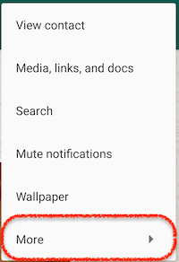
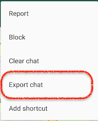

# ChatStats

## Overview

This project originated as a way to learn Deno, and get a fun outcome out of it.

It generates charts and statistics from a WhatsApp chat export, to visualize number of messages per week, referencing them to specified life milestones or events.

## Requirements

The only requirement is Deno 1.0 or above. Install by following the [official documentation](https://deno.land/#installation).

## Setup

After cloning the repository:
1. In your WhatsApp mobile app, from the chat screen, go to Options > More > Export chat

     
2. Place the exported `.txt` files in a folder in the project (i.e. `./data` folder).
3. Copy `config.sample.json` as `config.json` to the root of the project.
4. Copy `events.sample.json` as `events.json` (can be placed inside `./data` folder as well), and add or remove the relevant events if desired. For example:
    ```json
    {
      "events": {
        "2020-03-10": "COVID-19 lockdown started."
      }
    }
    ```
   NOTE: Date format id YYYY-MM-DD.
5. Update the configuration to match the desired data source folder and files, and the output file, for example:
    ```json
    {
      "port": 8000,
      "sourceFiles": [
        "./data/chat-export-part1.txt",
        "./data/chat-export-part2.txt"
      ],
      "eventsSource": "./data/events.json",
      "outputPath": "./output/stats.json"
    }
    ```

## Usage

1. Run `sh run start`.
2. Go to `http://localhost:8000` to see the stats in charts.

## Commands Reference

Commands have the following structure:

```bash
sh run <command>
```

Available commands:
* `start` to generate the stats and listen in port `8000` for web version.
* `fmt` to format code using [Prettier](https://prettier.io/) with the default settings.
* `test` to run the tests.
